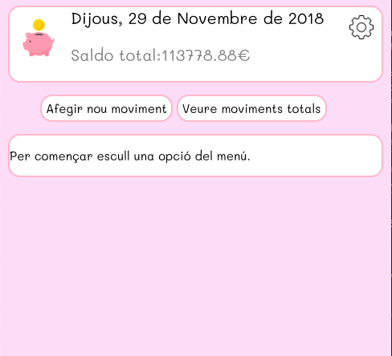

# Estalviar Més #

Aplicatiu per controlar les finances personals.

Amb aquest aplicatiu es poden controlar les despeses i els ingressos del nostre dia a dia.
Les dades es guarden en una Base de Dades MySQL. 
L'interface és totalment gràfica en un entorn web.

 1.- Disseny de la base de dades:

  
    Taules relacionades: 
        - Moviments -> taula principal 
        - Categories -> tipus de despesa/ingrés 
        - Mètodes de Pagament -> tipus de via de pagament (editable) 
        - Proveïdors -> taula editable

 2.- Captura de la pàgina principal:
 

## Funcions ##

Hi ha dues funcions principals: 
    - Introduir un apunt 
        Es pot introduir tant una despesa com un ingrès, i després es mostren tots el moviments efectuats. 
        Es mostren tots el moviments efectuats, endressats amb el més nou a dalt per defecte. 
        Es pot fer una cerca i filtrar desde la casella de cerca 
        Es poden endressar els resultats clicant a la capçalera de qualsevol columna 
    - Veure tots el moviments efectuats 
        Es mostren tots el moviments efectuats, endressats amb el més nou a dalt per defecte. 
        Es pot fer una cerca i filtrar desde la casella de cerca 
        Es poden endressar els resultats clicant a la capçalera de qualsevol columna 

També s'incorpora un apartat per la configuració: 
    - Mètodes de pagament 
        Aqui s'hi poden consultar/introduïr els mètodes de pagament i cobrament 
    - Categories 
        Aqui s'hi poden consultar les categories habilitades 
    - Proveïdors 
        Aqui s'hi poden consultar/introduïr els mètodes de pagament i cobrament 

