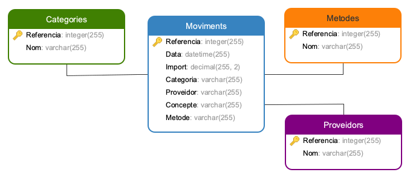

# Estalviar Més #

Aplicatiu per controlar les finances personals.

Amb aquest aplicatiu es poden controlar les despeses i els ingressos del nostre dia a dia.

 1.- Disseny de la base de dades:

  
    Taules relacionades: 
        - Moviments -> taula principal 
        - Categories -> tipus de despesa/ingrés 
        - Mètodes de Pagament -> tipus de via de pagament (editable) 
        - Proveïdors -> taula editable

 2.- Captura de la pàgina principal:
 

## Funcions ##

Hi ha dues funcions principals: 
        - introduir un apunt 
        - veure tots el moviments efectuats 

